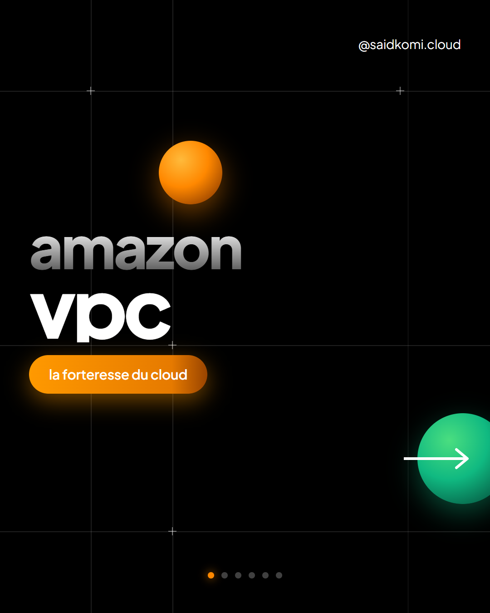
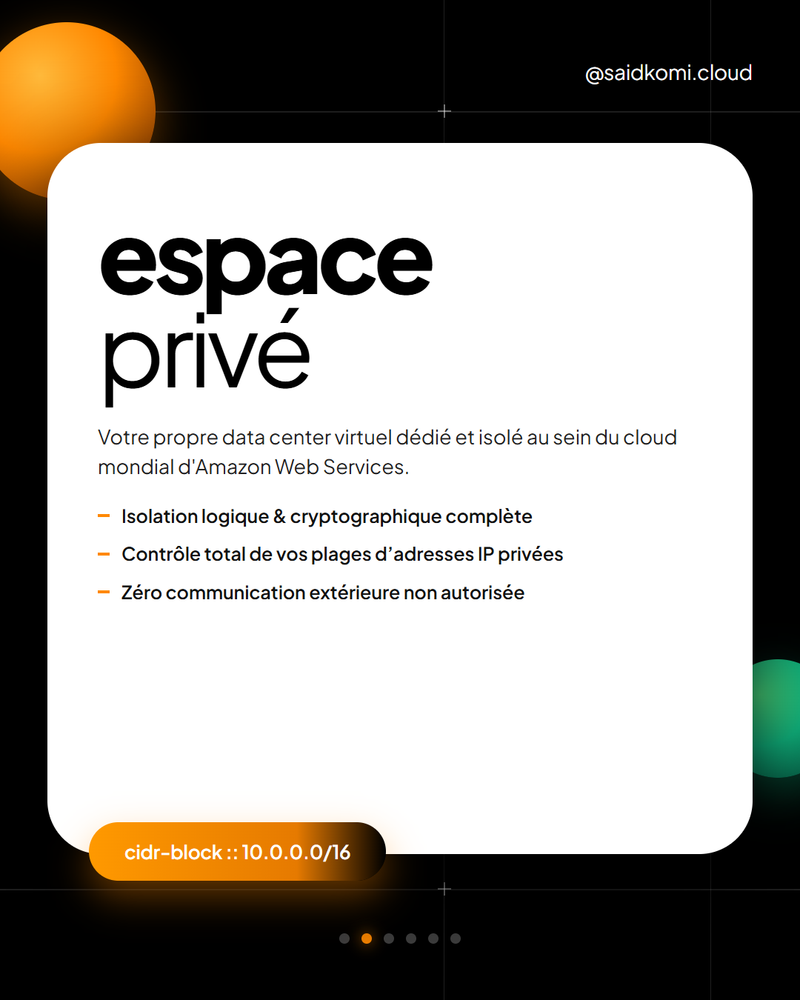
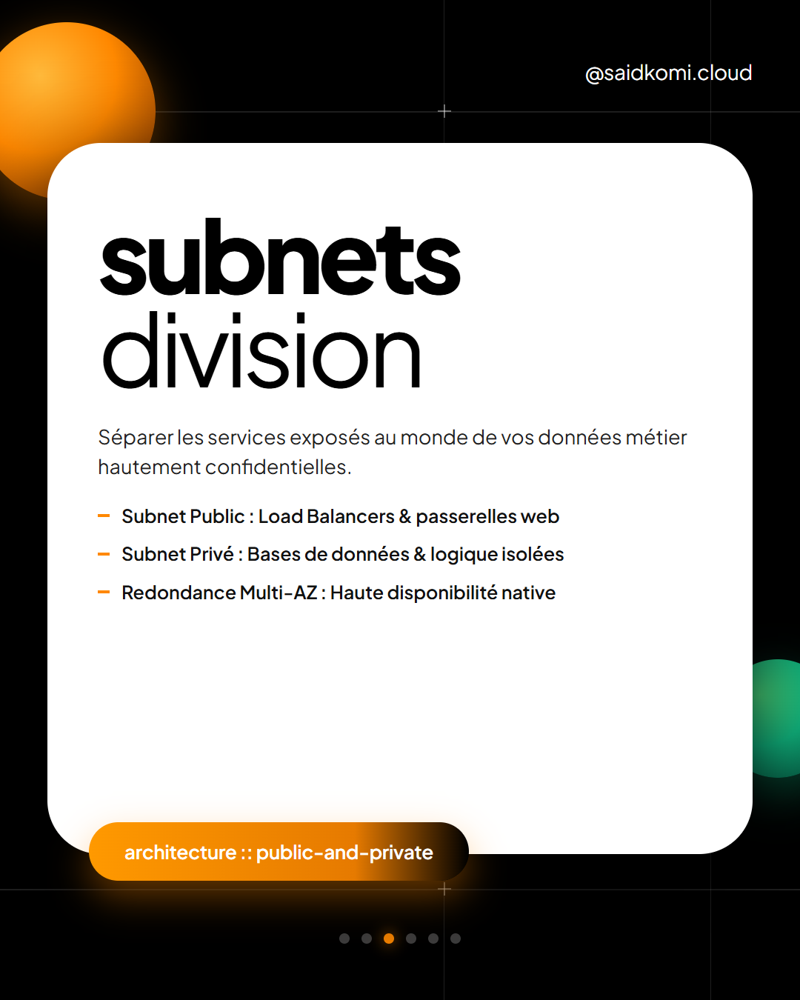
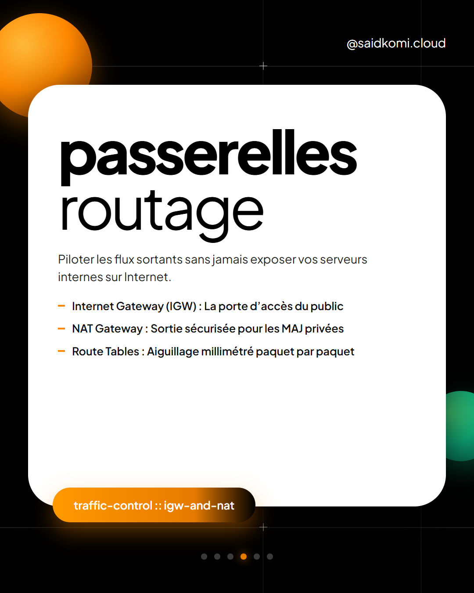
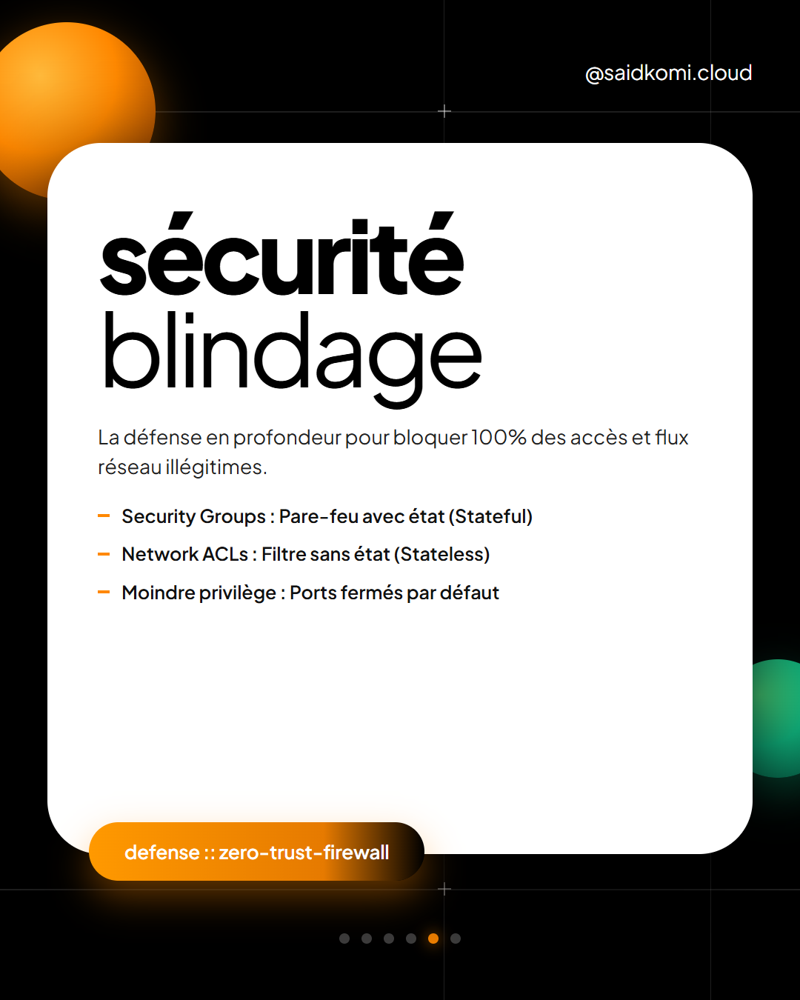
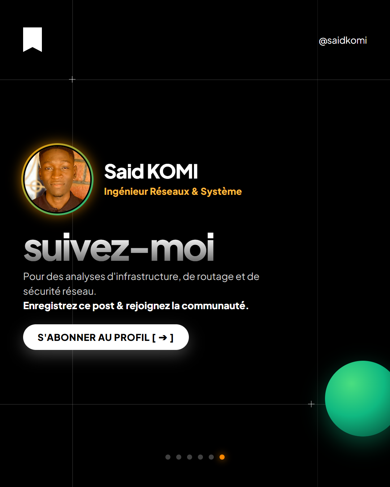

# MCP Carousel Engine

<div align="center">

[](https://opensource.org/licenses/MIT)
[](https://nodejs.org)
[](https://modelcontextprotocol.io)
[-orange)](https://github.com)
[](https://remotion.dev)

**The Professional Model Context Protocol (MCP) Server for High-End 4:5 Vertical Social Carousels.**  
*Designed and engineered by Said KOMI (Ingénieur Réseaux et Système).*

[Aperçu Visuel](#-aperçu-visuel--showcase) •
[Règles d'Or](#-les-5-règles-dor-du-système) •
[Installation](#-installation--configuration) •
[Outils MCP](#-outils-mcp-exposés) •
[Primitives React](#-boîte-à-outils-de-primitives-react) •
[Exemples](#-exemples-prêts-à-lemploi)

</div>

---

## [▸] Aperçu Visuel / Showcase

Voici un aperçu d'un carrousel réel de 6 slides produit avec **`mcp-carousel-engine`** sur le sujet **« Amazon VPC Architecture »** (*Thème Orange AWS & Vert Émeraude, Auteur : Said KOMI*) :

<div align="center">
  <table>
    <tr>
      <td width="33%"></td>
      <td width="33%"></td>
      <td width="33%"></td>
    </tr>
    <tr>
      <td align="center"><strong>01. Cover & Hook</strong></td>
      <td align="center"><strong>02. Espace Privé</strong></td>
      <td align="center"><strong>03. Subnets Division</strong></td>
    </tr>
    <tr>
      <td width="33%"></td>
      <td width="33%"></td>
      <td width="33%"></td>
    </tr>
    <tr>
      <td align="center"><strong>04. Passerelles & IGW</strong></td>
      <td align="center"><strong>05. Sécurité & NACLs</strong></td>
      <td align="center"><strong>06. Signature & CTA</strong></td>
    </tr>
  </table>
</div>

---

## [▸] Pourquoi ce Serveur MCP ?

Les carrousels sur les réseaux professionnels (**LinkedIn, Facebook, Instagram**) souffrent souvent de trois problèmes majeurs générés par les outils d'IA traditionnels :

1. **Le "Template AI Slop" :** Des mises en page génériques, plates, saturées d'émojis enfantins et sans identité visuelle.
2. **Le Débordement & Décalage CSS :** L'utilisation de librairies comme `html2canvas` qui cassent les masques de texte dégradés, tronquent les cartes et produisent des espaces blancs disproportionnés.
3. **Le Cadrage Défectueux des Photos :** Des avatars coupés au niveau du front ou des cheveux en haut de carte.

**`mcp-carousel-engine` résout mathématiquement ces problèmes.** Il fournit aux agents IA (**OpenCode, Claude Code, Cursor, Codex, Antigravity**) une suite de **primitives de design modulaires** et un **moteur de compilation Chromium natif** pour générer des visuels d'une netteté vectorielle absolue.

---

## [▸] Les 5 Règles d'Or du Système

| N° | Règle | Spécification Technique | Rationale |
| :---: | :--- | :--- | :--- |
| **01** | **Ratio 4:5 Vertical Strict** | Canvas fixé à **$1080\text{ px} \times 1350\text{ px}$** avec `overflow: hidden` et `box-sizing: border-box`. | Format d'engagement maximal sur mobile, élimine tout défilement parasite. |
| **02** | **Zéro Émoji (Strict Policy)** | Interdiction totale des émojis. Utilisation exclusive de glyphes (`::`, `//`, `[+]`, `[✓]`, `->`). | Confère un look d'ingénierie moderne, sobre et hautement professionnel. |
| **03** | **Éclairage 3D Volumétrique** | Dégradés radiaux multi-points (`radial-gradient(circle at 35% 30%, ...)`) avec halo coloré diffus. | Crée une illusion de profondeur tridimensionnelle sans nécessiter de moteur WebGL lourd. |
| **04** | **Cadrage Zéro Coupure de l'Avatar** | Ancrage optique calibré (`object-position: center 8%`) dans un médaillon à double anneau dégradé. | Garantit que le visage, le front et les cheveux de l'auteur sont toujours parfaitement visibles. |
| **05** | **Rendu Chromium Natif** | Compilation headless via Chromium (Remotion Stills) à échelle 1:1. | Élimine à 100% les décalages de rendu et les pertes de calques CSS. |

---

## [▸] Installation & Configuration

### 1. Cloner et compiler le serveur

```bash
git clone https://github.com/DEvauthentic/mcp-carousel-engine.git
cd mcp-carousel-engine
npm install
npm run build
```

### 2. Déclarer dans vos Agents IA

#### Pour Claude Desktop (`claude_desktop_config.json`) :
```json
{
  "mcpServers": {
    "carousel-engine": {
      "command": "node",
      "args": ["/chemin/absolu/vers/mcp-carousel-engine/dist/index.js"]
    }
  }
}
```

#### Pour OpenCode / Antigravity / Cursor (`mcp_config.json` ou `.cursor/mcp.json`) :
```json
{
  "mcpServers": {
    "carousel-engine": {
      "command": "node",
      "args": ["c:/VEILLE TECHNOLOGIQUE/laboratoires/agentic-google/mcp-carousel-engine/dist/index.js"]
    }
  }
}
```

---

## [▸] Outils MCP Exposés

### 1. `get_design_rules`
Retourne à l'agent l'ensemble des règles typographiques, de ratio et de contraste pour cadrer sa génération de contenu.

### 2. `list_creative_archetypes`
Fournit un catalogue d'archétypes de design prêts à être remixés :
* **`neo-geometric-dark`** : Le style signature Said KOMI (Fond noir `#000000`, cartes blanches contrastées, sphères 3D orange/émeraude, capsules dégradées).
* **`frosted-glass-blueprint`** : Cartes translucides en verre dépoli (`backdrop-filter: blur(40px)`), accents cyan et repères laser.
* **`minimal-luxury-monolith`** : Fond craie `#F4F3EF`, carte monolithique noir obsidienne et pierre d'ambre 3D.

### 3. `list_design_primitives`
Liste l'ensemble des composants React modulaires utilisables pour composer des slides personnalisées.

### 4. `render_carousel_project`
Prend un fichier ou objet JSON décrivant les slides et génère :
* Les images PNG haute définition ($1080 \times 1350\text{ px}$).
* Le visualiseur web interactif `index.html`.

---

## [▸] Boîte à Outils de Primitives React

Les agents peuvent assembler ces composants en toute liberté :

```tsx
import { 
  SlideCanvas, 
  WireframeGrid, 
  ShadedOrb3D, 
  LayeredCard, 
  PillBadge, 
  GradientMaskText, 
  ProfileMedal, 
  CarouselDots 
} from 'mcp-carousel-engine/primitives';

// Exemple de Slide 01 (Hook & Titre Dégradé)
export const Slide01 = () => (
  <SlideCanvas backgroundColor="#000000">
    <WireframeGrid hLines={[220, 1120]} vLines={[200, 880]} />
    <ShadedOrb3D size={140} colorTheme="orange" top={310} left={350} />
    
    <div style={{ zIndex: 3, marginTop: 'auto', marginBottom: 'auto' }}>
      <GradientMaskText text="amazon" fontSize={130} />
      <div style={{ fontSize: 180, fontWeight: 900, color: '#FFFFFF', lineHeight: 0.88 }}>vpc</div>
      <PillBadge text="la forteresse du cloud" />
    </div>

    <CarouselDots activeIndex={0} total={6} />
  </SlideCanvas>
);
```

---

## [▸] Exemples Prêts à l'Emploi

Deux exemples complets et testés sont inclus dans le dossier [`examples/`](./examples/) :
1. [`examples/aws-vpc-carousel.json`](./examples/aws-vpc-carousel.json) — Carrousel d'architecture réseau AWS VPC (6 slides).
2. [`examples/docker-networking-carousel.json`](./examples/docker-networking-carousel.json) — Deep dive sur les drivers réseau Docker (Bridge, Host, Macvlan, Overlay).

---

## [▸] Exemple de Prompt pour votre Agent IA

Une fois le serveur MCP connecté, il vous suffit de demander à votre agent :

> *"Crée un carrousel de 6 slides sur Kubernetes Networking avec le serveur MCP carousel-engine. Thème cyan, auteur Said KOMI (Ingénieur Réseaux & Système)."*

L'agent va :
1. Consulter `get_design_rules` et `list_creative_archetypes`.
2. Rédiger les textes percutants selon la structure de storytelling validée.
3. Appeler `render_carousel_project`.
4. Livrer les fichiers PNG $1080 \times 1350\text{ px}$ et le visualiseur web interactif.

---

## [▸] Auteur & Licence

* **Concepteur & Architecte :** **Said KOMI**  
* **Rôle :** Ingénieur Réseaux et Système  
* **Licence :** [MIT License](./LICENSE)
